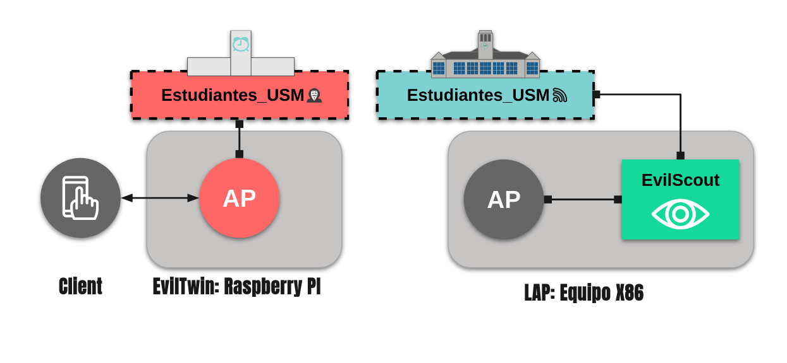
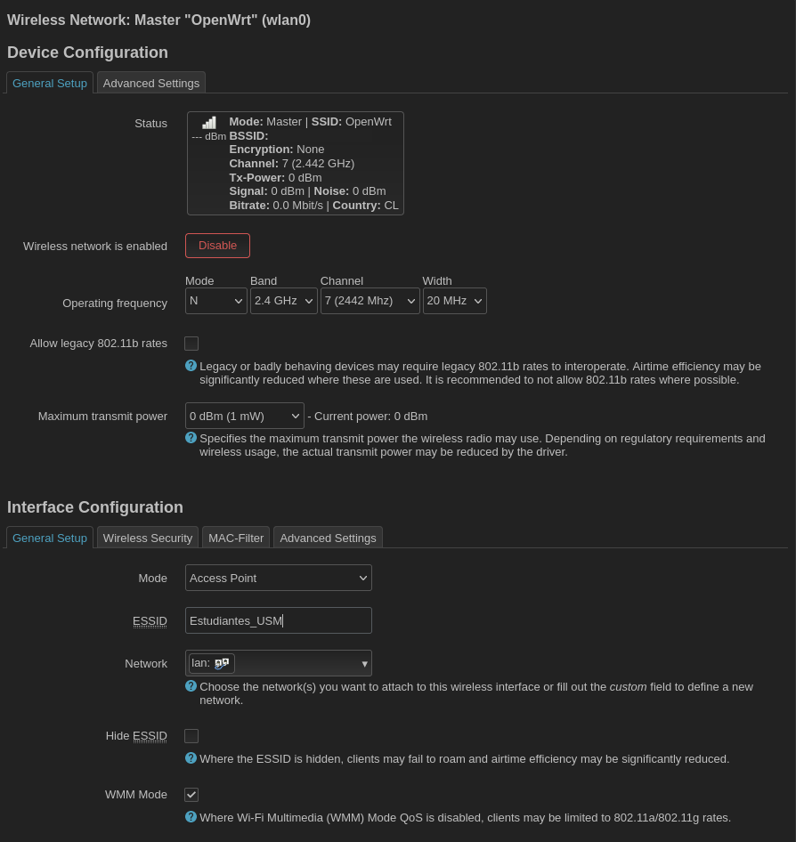
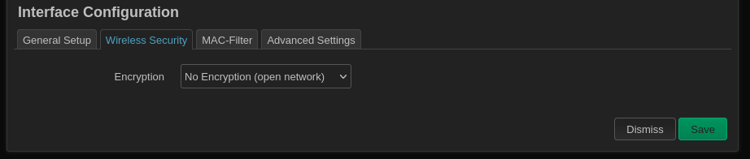

# EvilScout

A small-scale test and evaluation of an implementation of the EvilScout algorithm for the detection of EvilTwins on WLAN. 

**This implementation is based on the work defined by the authors of EvilScout:**

```
P. Shrivastava, M. S. Jamal and K. Kataoka, "EvilScout: Detection and Mitigation of Evil Twin Attack in SDN Enabled WiFi," in IEEE Transactions on Network and Service Management, vol. 17, no. 1, pp. 89-102, March 2020, doi: 10.1109/TNSM.2020.2972774.
```

The worked carried out on the context of the final project of the master's class 'IPD438 Computer Networking Seminar'. 

## Index

1. Objective

## Objective

The main goal of the tests and evaluations performed is to understand how the technique works in detecting the presence of the EvilTwin.
    
    - A validation of the dual association phenomena and how it occurs during the attack is performed.
    - An evaluation of the algorithm is done in a small-scale test.
    - The characterization of the EvilTwin type of attack is performed in order to understand the limitations of the detection technique.

## Experimental Setup



The small scale experiment is structured as it follows, a WLAN is deployed on top of an x86 machine running OpenWRT. A Wireless card is used to allow for connectivity and AP like behavior. This machine emulates the set *Legitimate-Access-Point (LAP)* and SDN controller. Given that the SDN controller senses the APs to check for suspicious traffic that allows it to detect the presence of the EvilTwin it can be simplified by forging together the AP and controller. This simplification allowed by the extra capabilities of the X86 machine in contrast to a normal AP. In this configuration a sample network called `Estudiantes_USM` is used to performed the experiment. 

The detection algorithm runs on the LAP-SDN set, given that OpenWrt (linux-based OS) is running on the AP, the algorithm can be implemented easily using Python and the Scapy library. 

For the EvilTwin a Raspberry PI 2B running Kali-Linux in conjunction with two TP-Link AC600 networks cards is used. The first interface is used to allow for the deployment of the EvilTwin and the second one to grant remote connectivity to the PI. 


### LAP-SDN: OpenWRT configuration

For the x86 machine a Asus FX504GD notebook with an Intel Core I5 processor, 8Gb of DDR4 and a 

#### Boot device

For burning an x86 image onto a USB drive follow the instructions available on OpenWrt's page: [OpenWrt on x86 hardware (PC / VM / server)](https://openwrt.org/docs/guide-user/installation/openwrt_x86). In this tutorial the image : `openwrt-22.03.2-x86-64-generic-ext4-combined-efi.img` was used.

#### Configuring ethernet port IP address

To facilitate the configuration of the device I recommend to configure the ethernet port of the AP to allow remote connection and ssh access.

For this, from the terminal of the AP enter the following command:

```
vi etc/config/network
```

This should display the network configuration file on the VI text editor. From here, change the IP assigned to the `lan` interface (for this to appear already configured the ethernet cable should be connected). In my case the IP was statically configured to 192.168.0.100/24 to connect directly to my LAN router: 

```
config interface 'lan'
	option device 'br-lan'
	option proto 'static'
	option ipaddr '192.168.0.100'
	option netmask '255.255.255.0'
	option ip6assign '60'
	option gateway '192.168.0.1'
	list dns '1.1.1.1'
```
I also recommend to add the gateway and dns of your choice (this can also be configured later from the browser interface). Save the changes and reload the network configuration by issuing the following command: 
```
service network restart
```

You can check if the changes work by typing the IP assigned to the ethernet interface of the AP in a browser (from a device in the same network) and if you are greeted with OpenWrt's login page it worked. 

If you configured the gateway, dns and the network you used is connected to the internet is recommended to perform a package update using 
```
opkg update
```

**Note: By default the device password is blank, for the browser interface and for ssh to the device, as this is just a small test and not a deployment of network infrastructure this is left as it is, but if you are doing this in any other context I strongly suggest you change this default password.**


#### Using the notebook integrated wireless card

By default no wireless driver is loaded on the OS. To use the network interface is needed to install the proper drivers. In my case the card was a `Intel(R) Wireless-AC 9560` so it needed the `iwlwifi` kernel modules and the 9000 firmware package. :

```
opkg update
opkg install kmod-iwlwifi
okpg install iwlwifi-firmware-iwl9000
opkg install hostapd 

```
After the installation is done, reboot the device. If all worked, when issuing the following command the wireless should appear listed as `wlan0`:

```
ifconfig -a 
```

Example output, HWaddr was censored as XX:XX:XX:XX:XX:XX:
```
wlan0     Link encap:Ethernet  HWaddr XX:XX:XX:XX:XX:XX  
          BROADCAST MULTICAST  MTU:1500  Metric:1
          RX packets:0 errors:0 dropped:0 overruns:0 frame:0
          TX packets:0 errors:0 dropped:0 overruns:0 carrier:0
          collisions:0 txqueuelen:1000 
          RX bytes:0 (0.0 B)  TX bytes:0 (0.0 B)

```


**Note: Other network drivers can be found on OpenWrt's driver page: [WLAN DRIVERS](https://openwrt.org/docs/techref/driver.wlan/start)**


From the browser interface now a Wireless option should appear in the network tab. Select the wireless tab and edit the WAN to have this requirements:

| SSID | Band | Channel | Power |
|------|------|---------|-------|
| Estudiantes_USM | 2.4 GHz | 7 | 0 dBm|




In security configure to OpenNetwork:




Save and apply the changes, after a few seconds the Network should be activated and accessible to clients. 


